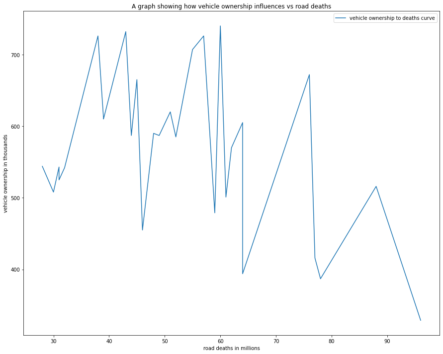
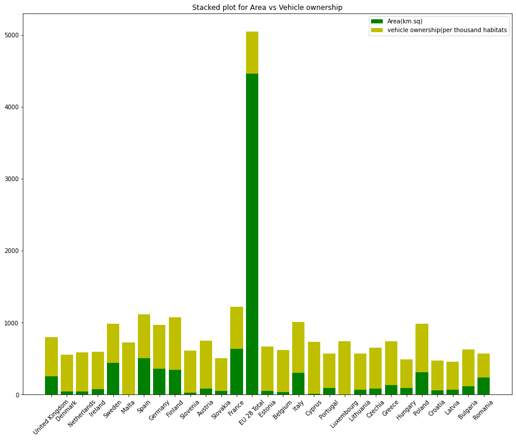
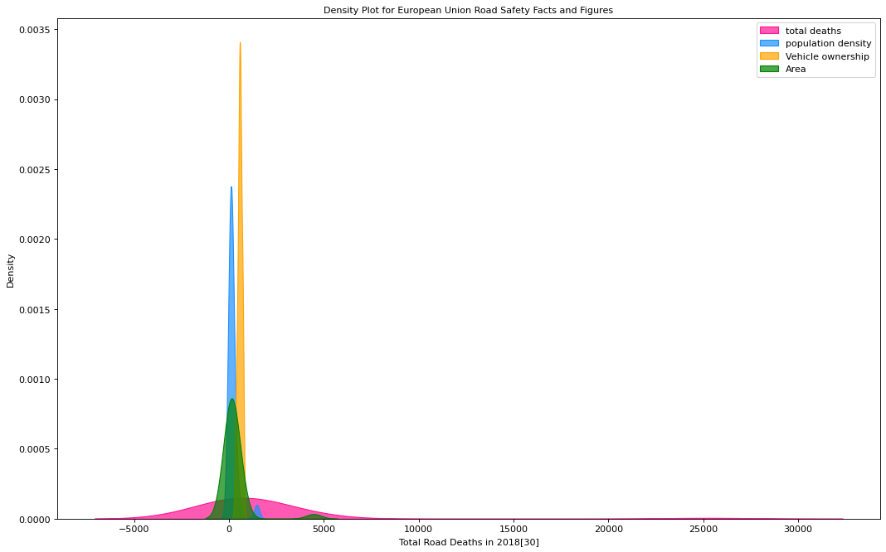
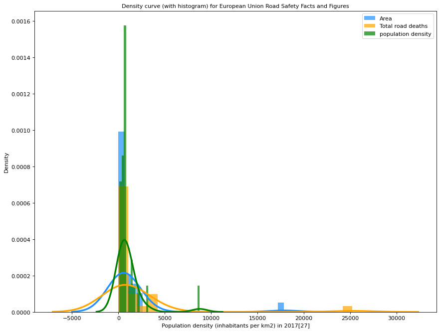

# Data Scraping Project

**This is a simple data scraping project where I fetched a table from a wikipedia page, organized the data by specifying 
the required rows and then sorting with respect to the relevant field, produced infographic visualizations to decribe some components
of the data by juxtaposing with other data fields, after which I then stored it in a csv file which I provided in the project folder.**  


To use this project locally you must have [python](https://www.python.org/downloads/) installed.

1. **Clone the repository:**
    ```sh
    git clone -b master https://github.com/Kingard/DatopianProject.git
    ```
2. **Setup the virtual environment by running:**
    ```sh
    virtualenv env
    source env/Scripts/activate # for windows
    source env/bin/activate # for MacOs
    ```
    in the project root folder.
3. **Install External Dependencies:**
    ```sh
    pip install -r requirements.txt

4. **Running the script**

## Scripts

### European Union Road Safety Facts and Figures
Located at [scripts/script.py](scripts/script.py) this script *pandas* to fetch the **European Union Road Safety Facts and Figures table**. 

There is just 1 function in the [scripts/script.py](scripts/script.py) the **`get_data`** function.<br>
- The **`get_data_list`** function takes the [wikipedia](https://en.wikipedia.org/wiki/Road_safety_in_Europe), and returns a table (pandas dataframe) containing the relevant data fields associated with the European Union Road Safety's quantitative reports and then stores it in a **csv file**.


The second script located at [scripts/script.py](scripts/script.py) contains a range of comparative plots for the data fields. <br> The plot images are located in [natural_gas_prices/get_daily_prices.py](natural_gas_prices/get_ng_prices.py) 

1.  **Line Graph showing the vehicle ownership vs death curve** <br> This plot shows the correlation between vehicle ownership and death rate. It's intuitive to observe that death rate (via road accidents) is directly proportional to the increase in vehicle ownership over a given time window.  
	```py
	plt.figure(figsize=(15,12))
	plt.plot(required_data['Road deaths per Million Inhabitants in 2018[30]'],required_data['Vehicle ownership (per thousand inhabitants) in 2016[28]'],label='vehicle ownership to deaths curve')
	plt.plot()
	plt.ylabel('vehicle ownership in thousands')
	plt.xlabel('road deaths in millions')
	plt.title("A graph showing how vehicle ownership influences vs road deaths")
	plt.legend()
	plt.show()
	```
	 

2.  **Stacked bar plot for vehicle ownership against area** <br> This plot shows the relationship between land mass (area in sq.km) and vehicle ownership. It essentially describes how vehicles are distributed per unit land mass for each country
	```py
	plt.figure(figsize=(15,12))
	plt.bar(required_data['Country'],y['Area (thousands of km2)[24]'],color='g')
	plt.bar(y['Country'],y['Vehicle ownership (per thousand inhabitants) in 2016[28]'],bottom= required_data['Area (thousands of km2)[24]'] ,color='y')
	plt.xticks(rotation = 45)
	plt.title('Stacked plot for Area vs Vehicle ownership')
	plt.legend(['Area(km.sq)','vehicle ownership(per thousand habitats',])
	plt.show()
	```
	

3.  **Density Plot for European Union Road Safety Facts and Figures** <br> This plot gives quantitative distribution of popuation, area, total deaths and vehicle ownership (on the vertical axis) over the deaths that occured by road accidents (on the horizontal axis).
	```py
	plt.figure(figsize=(16,10), dpi= 80)
	sns.kdeplot(required_data['Total Road Deaths in 2018[30]'],shade=True, color="deeppink", label="total deaths", alpha=.7)
	sns.kdeplot(required_data['Population density (inhabitants per km2) in 2017[27]'],shade=True, color="dodgerblue", label="population density", alpha=.7)
	sns.kdeplot(required_data['Vehicle ownership (per thousand inhabitants) in 2016[28]'],shade=True, color="orange", label="Vehicle ownership", alpha=.7)
	sns.kdeplot(required_data['Area (thousands of km2)[24]'],shade=True, color="g", label="Area", alpha=.7)
	plt.title('Density Plot for European Union Road Safety Facts and Figures', fontsize=10)
	plt.legend()
	plt.show()
	```
	

4.  **Density Curve with histogram** <br> This is a combination of the density curve and histogram for total area (land mass) and total deaths as they area distributed over population density (per sq.km)
	```py
	plt.figure(figsize=(13,10), dpi= 80)
	sns.distplot(required_data['Area (thousands of km2)[24]']*4, color="dodgerblue", label="Area", hist_kws={'alpha':.7}, kde_kws={'linewidth':3})
	sns.distplot(required_data['Total Road Deaths in 2018[30]'], color="orange", label="Total road deaths", hist_kws={'alpha':.7}, kde_kws={'linewidth':3})
	sns.distplot(required_data['Population density (inhabitants per km2) in 2017[27]']*6, color="g", label="population density", hist_kws={'alpha':.7}, kde_kws={'linewidth':3})
	plt.title('Density curve (with histogram) for European Union Road Safety Facts and Figures', fontsize=10)
	plt.legend()
	plt.show()
	```
	